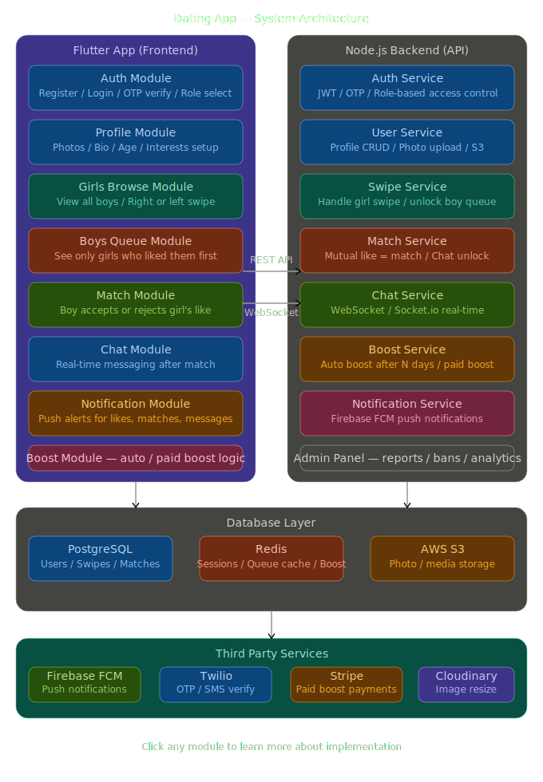

# Reverse Match

Reverse Match is a full-stack dating platform where girls choose first:

- Girls browse boy profiles using a swipe experience.
- Boys do not browse girls directly.
- Boys receive incoming likes in a queue and can accept or reject.
- A match is created only when the boy accepts.
- Chat unlocks after a match.

This repository contains:

- `backend/` - Node.js + Express API + Socket.IO
- `reverse_match/` - Flutter mobile app (Android + iOS + desktop/web scaffolding)

---

## Table of Contents

1. [Architecture](#architecture)
2. [Features](#features)
3. [Tech Stack](#tech-stack)
4. [Repository Structure](#repository-structure)
5. [Prerequisites](#prerequisites)
6. [Quick Start](#quick-start)
7. [Environment Configuration](#environment-configuration)
8. [API Overview](#api-overview)
9. [Socket Events](#socket-events)
10. [Scripts](#scripts)
11. [Docker](#docker)
12. [CI Pipeline](#ci-pipeline)
13. [Production Checklist](#production-checklist)
14. [Troubleshooting](#troubleshooting)
15. [Additional Documentation](#additional-documentation)

---

## Architecture

High level architecture diagram:



Core flow:

1. Client authenticates via OTP or Google.
2. User completes profile setup.
3. Girls fetch swipe feed and like/skip.
4. Boys fetch queue and accept/reject.
5. Match creation unlocks real-time chat.
6. Notifications are sent via Firebase (if configured).
7. Paid boosts are processed via Stripe checkout + webhook.

---

## Features

### Authentication

- Email OTP login/signup
- Google sign-in
- JWT access + refresh token flow
- Refresh token hashing and invalidation on logout

### Profile

- Profile create/update
- Photo upload/delete/reorder (Cloudinary)
- Bio, interests, location, preferences
- Profile completeness checks

### Core Match Logic

- Girls-only swipe feed
- Boys-only incoming likes queue
- Accept/reject queue actions
- Match list with last message + unread count
- Unmatch/delete conversation

### Real-Time Chat

- Socket.IO authentication via JWT
- Join match rooms
- Send messages
- Typing indicators
- Read receipts

### Boost System

- Automatic visibility boost based on `daysWithoutMatch`
- Paid boost tiers: bronze/silver/gold
- Stripe checkout + webhook activation
- Daily cron jobs for boost counters and cleanup

### Safety and Account

- Report user
- Block user
- Account deletion (with associated data cleanup)
- Rate limiting and request sanitization

---

## Tech Stack

### Backend

- Node.js 22
- Express 5
- MongoDB + Mongoose
- Redis + `express-rate-limit` + `rate-limit-redis`
- Socket.IO + Redis adapter
- Stripe
- Cloudinary
- Firebase Admin SDK
- Joi validation
- Pino logging
- Docker + PM2

### Mobile App

- Flutter 3 / Dart 3
- Riverpod
- GoRouter
- Dio
- socket_io_client
- flutter_secure_storage
- shared_preferences
- image_picker
- geolocator / geocoding

---

## Repository Structure

```text
.
|-- backend/                  # Express API, Mongo models, services, sockets
|-- reverse_match/            # Flutter app
|-- docker-compose.yml        # API + Mongo + Redis stack
|-- dating_app_architecture.svg
|-- COMPLETE_CODE_EXPLANATION.txt
|-- New Text Document.txt     # initial requirement/spec
```

---

## Prerequisites

Install the following:

- Node.js 22+
- npm 10+
- Flutter SDK (stable channel)
- MongoDB 7+ (if not using Docker)
- Redis 7+ (required in production, optional in local dev)

Optional external services:

- Cloudinary (image uploads)
- Firebase (push notifications)
- Stripe (paid boosts)
- SMTP provider (OTP email delivery)
- Sentry (error tracking)

---

## Quick Start

### 1) Clone and move to repo

```bash
git clone <your-repo-url>
cd dating
```

### 2) Configure backend env

```bash
# macOS/Linux
cp backend/.env.example backend/.env

# Windows (PowerShell)
Copy-Item backend\.env.example backend\.env
```

Update `backend/.env` with your real values.

### 3) Start backend (Docker recommended)

```bash
docker compose up --build
```

API health check:

```bash
curl http://localhost:5000/health
```

### 4) Start Flutter app

```bash
cd reverse_match
flutter pub get
flutter run --dart-define=ENV=development
```

---

## Environment Configuration

### Backend (`backend/.env`)

Use `backend/.env.example` as the source of truth.

Critical variables:

- `MONGO_URI` (required)
- `JWT_ACCESS_SECRET` (required)
- `JWT_REFRESH_SECRET` (required)
- `REDIS_URL` (required in production)
- `CLOUDINARY_*` (required for photo upload)
- `STRIPE_SECRET_KEY` + `STRIPE_WEBHOOK_SECRET` (required for paid boost)
- `GOOGLE_CLIENT_ID` (required for Google login)
- `SMTP_*` (required for real OTP email delivery outside dev)
- `APP_BASE_URL`, `APP_DEEP_LINK_SCHEME`
- `PRIVACY_POLICY_URL`, `TERMS_OF_SERVICE_URL`

### Flutter (`reverse_match/.env*`)

The app supports environment files:

- `.env` (development)
- `.env.staging`
- `.env.production`

Keys used:

- `API_BASE_URL`
- `SOCKET_URL`

Run with:

```bash
flutter run --dart-define=ENV=development
flutter run --dart-define=ENV=staging
flutter run --dart-define=ENV=production
```

---

## API Overview

Base URL: `http://localhost:5000/api/v1`

### Auth

- `POST /auth/signup`
- `POST /auth/verify-otp`
- `POST /auth/google`
- `POST /auth/refresh-token`
- `POST /auth/logout`

### Profile

- `GET /profile`
- `PUT /profile`
- `POST /profile/photos`
- `DELETE /profile/photos/:publicId`
- `PUT /profile/photos/reorder`

### Swipe (female only)

- `GET /swipe/feed`
- `POST /swipe/like`
- `POST /swipe/skip`
- `POST /swipe/undo`

### Queue (male only)

- `GET /queue`
- `POST /queue/accept/:likeId`
- `POST /queue/reject/:likeId`

### Matches and Messages

- `GET /matches`
- `DELETE /matches/:matchId`
- `GET /messages/:matchId`
- `POST /messages`
- `PUT /messages/:matchId/seen`

### Boost

- `GET /boost/plans`
- `GET /boost/status`
- `POST /boost/purchase`
- `POST /boost/webhook` (Stripe webhook)
- `GET /boost/success` (payment return page)
- `GET /boost/cancel` (payment return page)

### Safety / Account

- `POST /report`
- `POST /block`
- `DELETE /account`
- `GET /config` (legal URLs)

---

## Socket Events

### Client -> Server

- `join-room` (`matchId`)
- `leave-room` (`matchId`)
- `send-message` (`{ matchId, text }`)
- `typing-start` (`matchId`)
- `typing-stop` (`matchId`)
- `mark-seen` (`{ matchId }`)

### Server -> Client

- `new-message`
- `messages-seen`
- `user-typing`
- `user-stopped-typing`
- `new-like`
- `new-match`

---

## Scripts

### Backend (`backend/package.json`)

```bash
npm run dev           # nodemon server.js
npm start             # node server.js
npm run start:prod
npm run start:cluster # pm2
```

Note:

- `npm run lint` and `npm test` are currently placeholders.

### Flutter (`reverse_match/`)

```bash
flutter pub get
flutter analyze
flutter test
flutter run --dart-define=ENV=development
```

---

## Docker

`docker-compose.yml` includes:

- `api` (backend container)
- `mongo` (MongoDB 7)
- `redis` (Redis 7)

Start:

```bash
docker compose up --build
```

Stop:

```bash
docker compose down
```

---

## CI Pipeline

GitHub Actions workflow: `.github/workflows/ci.yml`

Current jobs:

1. Backend install + lint + tests
2. Docker image build verification

---

## Production Checklist

Before release, complete these:

1. Add real backend tests and lint rules.
2. Add Flutter integration/widget tests beyond smoke test.
3. Configure Android release signing and production application ID.
4. Configure iOS production signing and capability settings.
5. Enable Firebase in Flutter app if push notifications are required.
6. Enable Sentry in Flutter app if crash tracking is required.
7. Set real legal URLs for privacy policy and terms.
8. Configure deep-link handling on Android/iOS for boost return URLs.
9. Secure and rotate secrets using your secret manager.
10. Load-test API and socket flows before launch.

---

## Troubleshooting

### PowerShell blocks `npm`

If script policy blocks `npm.ps1`, run commands via `cmd`:

```bash
cmd /c npm run dev
```

### Flutter command not found

Install Flutter SDK and ensure `flutter/bin` is on PATH.

### Redis unavailable in development

The backend can start without Redis in development mode, but with reduced behavior.

### Photo uploads fail

Check `CLOUDINARY_*` environment variables in `backend/.env`.

### OTP emails not sending

In development without SMTP config, OTP is logged to backend console.

### Flutter asset path errors

If Flutter reports missing `assets/images/` or `assets/lottie/`, either:

1. Create those directories, or
2. Remove/update those entries in `reverse_match/pubspec.yaml`.

---

## Additional Documentation

- Full implementation walkthrough: `COMPLETE_CODE_EXPLANATION.txt`
- Original product requirements: `New Text Document.txt`

---

## License

No license file is currently defined in this repository.
